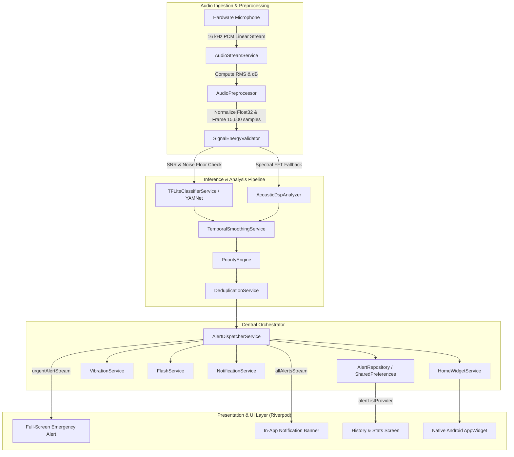
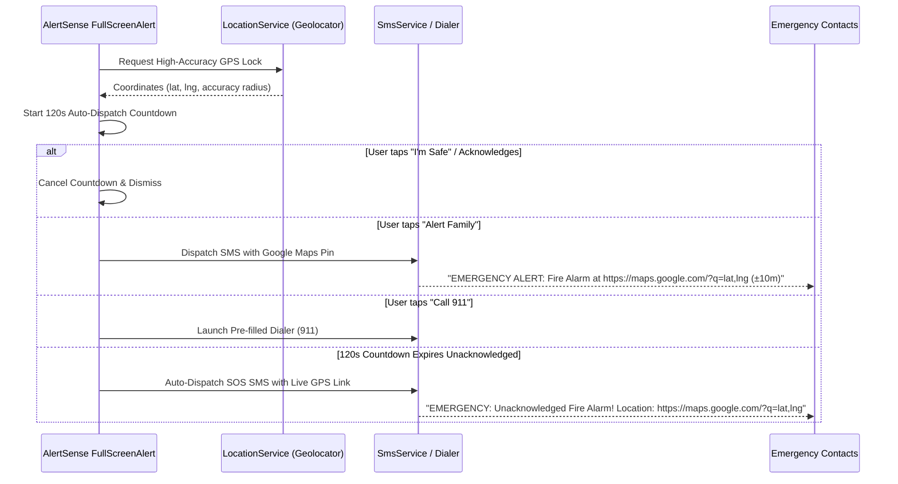

# 🚨 AlertSense — AI Environmental Sound Awareness System

> **"Turn critical environmental sounds into immediate, multi-sensory alerts you can see and feel."**

[](https://flutter.dev)
[](https://dart.dev)
[-FF6F00?style=for-the-badge&logo=tensorflow&logoColor=white)](https://tfhub.dev/google/lite-model/yamnet/tflite/1)
[](https://supabase.com)
[-3DDC84?style=for-the-badge&logo=android&logoColor=white)](https://android.com)
[-brightgreen?style=for-the-badge&logo=checkmarx&logoColor=white)](https://github.com/Samreen1216/AlertSense)
[](https://github.com/Samreen1216/AlertSense)
[](LICENSE)

---

## 📖 Table of Contents
1. [Executive Summary](#-executive-summary)
2. [Key Innovations & Feature Matrix](#-key-innovations--feature-matrix)
3. [System Architecture & Data Flow](#-system-architecture--data-flow)
4. [AI Inference & DSP Audio Pipeline](#-ai-inference--dsp-audio-pipeline)
5. [Multi-Sensory Alert & Hardware Feedback System](#-multi-sensory-alert--hardware-feedback-system)
6. [Emergency SOS & GPS Lifeline Uplink](#-emergency-sos--gps-lifeline-uplink)
7. [Smart Environmental Profiles & Sleep Mode](#-smart-environmental-profiles--sleep-mode)
8. [Native Android Home Screen AppWidget](#-native-android-home-screen-appwidget)
9. [Analytics Dashboard & PDF Incident Reports](#-analytics-dashboard--pdf-incident-reports)
10. [Cloud Identity, Auth & PKCE Security](#-cloud-identity-auth--pkce-security)
11. [Inclusive Accessibility & Multi-Theme Engine](#-inclusive-accessibility--multi-theme-engine)
12. [Offline AI Evaluation & Benchmarking Suite](#-offline-ai-evaluation--benchmarking-suite)
13. [Project Directory Structure](#-project-directory-structure)
14. [Tech Stack & Dependencies](#-tech-stack--dependencies)
15. [Hardware Permissions](#-hardware-permissions)
16. [Getting Started & Installation](#-getting-started--installation)
17. [Testing & Quality Assurance](#-testing--quality-assurance)
18. [Authors & Attribution](#-authors--attribution)

---

## 🌟 Executive Summary

**AlertSense** is a mission-critical, on-device AI sound awareness and emergency notification system engineered specifically for deaf, hard-of-hearing, and sound-vulnerable individuals. 

In everyday environments, critical acoustic signals—such as smoke alarms, breaking glass, emergency sirens, ringing doorbells, crying infants, or barking dogs—provide vital situational context. Without auditory perception, these life-safety cues can go completely unnoticed.

AlertSense bridges this divide by continuously capturing ambient acoustic streams, running on-device deep neural network inference (Google's YAMNet architecture) combined with a real-time Digital Signal Processing (DSP) validation pipeline, and translating detected events into instant **visual, tactile (haptic), and optical (camera strobe)** notifications.

```
┌─────────────────┐      ┌─────────────────────────┐      ┌─────────────────────────┐
│ Ambient Audio   │ ───► │ On-Device AI / DSP      │ ───► │ Multi-Sensory Alerts    │
│ (16 kHz PCM Mic)│      │ (YAMNet + FFT Analyzer) │      │ (Vibration, Flash, UI)  │
└─────────────────┘      └─────────────────────────┘      └─────────────────────────┘
                                                                       │
                                 ┌─────────────────────────────────────┴───────────────────────────────────┐
                                 ▼                                     ▼                                   ▼
                      ┌──────────────────────┐              ┌──────────────────────┐            ┌──────────────────────┐
                      │ High (Life Safety)   │              │ Medium (Attention)   │            │ Low (Awareness)      │
                      │ Fire, Siren, Glass   │              │ Doorbell, Knock, Cry │            │ Dog Bark, Horn, Shout│
                      │ • Full-screen strobe │              │ • Heads-up banner    │            │ • Discreet radar pip │
                      │ • Alarm haptic loop  │              │ • Signature haptic   │            │ • Status bar badge   │
                      │ • GPS SOS Lifeline   │              │ • Brief flash pulse  │            │ • History logging    │
                      └──────────────────────┘              └──────────────────────┘            └──────────────────────┘
```

---

## ⚡ Key Innovations & Feature Matrix

| Feature Domain | Capability | Technical Highlight |
|---|---|---|
| **Live Acoustic Radar** | Real-time rotating sweep & radial pips | Dynamic canvas CustomPainter with confidence-distance mapping & decibel gauge |
| **Dual Inference Engine** | Hybrid TFLite + Pure Dart DSP | Quantized YAMNet (521 AudioSet classes) + FFT spectral peak analyzer in background isolate |
| **3-Tier Priority Matrix** | High, Medium, Low urgency triage | Strict per-category confidence gating & noise floor thresholding |
| **Smart Cooldown & Deduplication** | Anti-alert fatigue aggregation | Collapses continuous alarms into single persistent notifications with duration tracking |
| **Tactile Rhythm Designer** | Interactive touchscreen haptic recorder | Millisecond-precision tap recording, waveform visualizer, and custom haptic library |
| **Emergency SOS Uplink** | Real-time GPS location lock & SMS dispatch | Automated Google Maps link generation, dialer shortcut (`911`), and WhatsApp fallback |
| **Sleep / Nightstand Mode** | OLED bedside clock with critical filter | Pure black `#000000` screen, oversized high-legibility clock, life-safety-only filter |
| **Android AppWidget** | Home screen widget integration | Kotlin `AlertSenseWidgetProvider` supporting 4 dynamic themes and live dB sync |
| **Incident Reporting** | Forensic PDF document generation | Complete chronological incident reports, decibel levels, timestamps, and export via `share_plus` |
| **Cloud Authentication** | Supabase Auth with PKCE | Email verification, deep-linked password recovery (`alertsense://auth-callback`), session caching |
| **Inclusive UX** | 4 accessible color themes + scalable text | Material 3 Light, Dark, High-Contrast OLED, Color-Blind Safe (IBM), 1.0x–2.0x font scaling |
| **AI Evaluation Engine** | Offline model benchmarking suite | Confusion matrices, Precision, Recall, F1-scores across 8 acoustic environmental conditions |

---

## 🏗️ System Architecture & Data Flow

AlertSense is structured using **Clean Architecture** principles, enforcing separation of concerns across Data, Domain, Infrastructure Services, State Providers, and Presentation:



---

## 🧠 AI Inference & DSP Audio Pipeline

### 1. Acoustic Ingestion & Framing
* **Sampling Format**: 16,000 Hz, 16-bit Linear PCM mono channel via `record`.
* **Normalization**: Audio samples are converted from signed 16-bit integers `[-32768, 32767]` to normalized 32-bit floating-point values `[-1.0, 1.0]`.
* **Window Size**: 15,600 samples (975 ms temporal window) matching the exact input tensor dimension required by Google's YAMNet.

### 2. Digital Signal Processing (DSP) Engine
* **FFT Spectral Decomposition**: 1024-point Fast Fourier Transform with Hann windowing to suppress spectral leakage.
* **Spectral Centroid & Flatness**: Evaluates center of mass of acoustic power spectrum to differentiate between harmonic tones and wideband noise.
* **Zero Crossing Rate (ZCR)**: Identifies high-frequency transient events like glass shatter.
* **Isolate Worker Execution**: Heavy DSP computations run inside a background Dart isolate via `compute()` to ensure zero UI jank or frame drops.

### 3. Temporal Smoothing & Hysteresis
* **Sliding Window Accumulator**: Applies moving average and exponential smoothing across sequential inference frames.
* **Hysteresis State Machine**: Requires consecutive confidence hits above the activation threshold to trigger an alert, and holds state until confidence falls below a lower deactivation threshold, completely eliminating classification jitter and fluttering.

### 4. Monitored Sound Categories & Urgency Matrix

```
┌───────────────────────┬────────────┬──────────────┬───────────────────────────────┐
│ Sound Category        │ Priority   │ Default Gate │ Key Acoustic Features         │
├───────────────────────┼────────────┼──────────────┼───────────────────────────────┤
│ 🚨 Fire & Smoke Alarm │ HIGH       │ 70% (0.70)   │ 3 kHz pure tone, T3/T4 rhythm │
│ 🚓 Emergency Siren    │ HIGH       │ 70% (0.70)   │ 500–1500 Hz frequency sweep  │
│ 💥 Glass Breaking     │ HIGH       │ 65% (0.65)   │ High ZCR, wideband transient  │
│ 🔔 Doorbell           │ MEDIUM     │ 65% (0.65)   │ Dual chime (660 Hz / 550 Hz)  │
│ ✊ Door Knocking      │ MEDIUM     │ 60% (0.60)   │ Low-frequency pulsed transient│
│ 👶 Baby Crying        │ MEDIUM     │ 65% (0.65)   │ 400–600 Hz harmonic wailing   │
│ 🐕 Dog Barking        │ LOW        │ 60% (0.60)   │ 200–1000 Hz acoustic burst    │
│ 🚗 Car / Vehicle Horn │ LOW        │ 65% (0.65)   │ 400–800 Hz continuous blast   │
│ 🗣️ Shouting & Yelling │ LOW        │ 60% (0.60)   │ High-energy vocal formants    │
└───────────────────────┴────────────┴──────────────┴───────────────────────────────┘
```

---

## 📳 Multi-Sensory Alert & Hardware Feedback System

AlertSense engages all remaining senses when auditory perception is unavailable:

```
                  ┌────────────────────────────────────────┐
                  │        AlertSense Sensory Matrix       │
                  └────────────────────────────────────────┘
                                      │
         ┌────────────────────────────┼────────────────────────────┐
         ▼                            ▼                            ▼
┌──────────────────┐         ┌──────────────────┐         ┌──────────────────┐
│  Tactile Haptics │         │  Optical Strobe  │         │  Visual Displays │
├──────────────────┤         ├──────────────────┤         ├──────────────────┤
│ • Custom rhythms │         │ • 5Hz LED strobe │         │ • Full-screen    │
│ • Millisecond    │         │ • High-priority  │   glow overlay   │
│   pulse arrays   │           life safety only │ • Heads-up banner│
│ • Sleep boost    │         │ • Timed duration │ • Decibel meter  │
│ • Tap recorder   │         │ • Torch control  │ • Sound radar    │
└──────────────────┘         └──────────────────┘         └──────────────────┘
```

### 1. Tactile Vibration Designer
* **Interactive Waveform Recording**: Users can tap custom rhythms onto an interactive canvas to record bespoke tactile signatures.
* **Millisecond Precision**: Records precise pulse/pause durations (e.g., `[0, 500, 200, 500, 200, 1000]`).
* **Sleep Mode Amplification**: Dynamically boosts vibration amplitude override during bedtime hours.

### 2. Optical Flash Strobing
* **Hardware Camera LED**: Driven by `torch_light` to pulse at 5 Hz during High-priority emergencies.
* **Automated Timeout**: Strobe duration is automatically constrained to prevent battery depletion and thermal throttling.

### 3. Android Notification Channels
* **High Priority Channel**: `alerts_high` with `Importance.max`, heads-up display banner, and bypass Do-Not-Disturb support.
* **Medium Priority Channel**: `alerts_medium` with `Importance.high` and signature haptics.
* **Low Priority Channel**: `alerts_low` with `Importance.low` for silent background awareness.

---

## 📍 Emergency SOS & GPS Lifeline Uplink

During life-safety emergencies (e.g. Fire Alarm or Glass Breaking), AlertSense provides automated and one-tap emergency workflows:



* **Continuous-Event Deduplication**: If a siren or alarm rings continuously for minutes, unacknowledged auto-dispatch sends **strictly once per continuous event** to avoid spamming emergency services or family members.
* **Google Maps Pin Generation**: Direct URL formatting (`https://maps.google.com/?q=latitude,longitude`) with accuracy radius snippet (`±12m`).

---

## 🌙 Smart Environmental Profiles & Sleep Mode

AlertSense adapts its detection thresholds, enabled sounds, and feedback behaviors to the user's immediate environment:

* **🏠 Home Profile**: Balanced sensitivity for domestic alerts (Doorbell, Knocking, Baby Crying, Fire Alarm, Glass Breaking).
* **🌙 Sleep / Nightstand Mode**: 
  * Ultra-minimalist OLED pure black interface (`#000000`) acting as a bedside digital clock.
  * Filters strictly for life-safety events (Fire Alarm, Emergency Siren, Baby Crying).
  * Automatically applies maximum vibration amplitude boost.
* **🌳 Outdoor Profile**: Dynamically raises noise floor filters to suppress traffic hum while prioritizing vehicle horns, sirens, and shouting.
* **🛠️ Profile Editor**: Granular toggles to enable/disable individual sounds and tune detection thresholds per sound category.

---

## 📲 Native Android Home Screen AppWidget

AlertSense features a native Android AppWidget powered by Kotlin (`AlertSenseWidgetProvider`) and `home_widget`:

```
┌────────────────────────────────────────────────────────┐
│  🚨 AlertSense Live Monitor             [ LIVE ● ]     │
├────────────────────────────────────────────────────────┤
│  Profile: Home                          dB: 42 dB      │
│  Last Alert: Doorbell Detected (92%)    2m ago         │
├────────────────────────────┬───────────────────────────┤
│  [ 🚨 Instant SOS ]        │  [ ⚡ Quick Scan ]        │
└────────────────────────────┴───────────────────────────┘
```

* **4 Dynamic Themes**: Automatically matches the app's theme (Material Light, Dark, High-Contrast OLED, Color-Blind Safe).
* **Live Status Synchronization**: Displays real-time listening state, ambient dB level, and most recent alert.
* **Interactive Shortcuts**: Direct one-tap launch to Quick Scan or Emergency SOS.

---

## 📊 Analytics Dashboard & PDF Incident Reports

### 1. Interactive Trend Insights (`fl_chart`)
* **Top Detected Sound**: Highlight card showing the most frequent weekly sound and count.
* **Category Breakdown Chart**: Multi-color comparative bar chart across all 9 monitored sound categories.
* **Time-of-Day Distribution**: Categorizes alert frequency into Morning, Afternoon, Evening, and Night.
* **7-Day Trend Line**: Visualizes alert volume fluctuations over time.

### 2. Forensic PDF Incident Export (`pdf` + `share_plus`)
* Generates polished, vector-rendered incident reports complete with:
  * Summary KPI cards (Total Alerts, High Urgency Count, Peak dB, Verification Ratio).
  * Categorical distribution summary.
  * Chronological incident log table with formatted timestamps, decibel readings, confidence percentages, and user acknowledgments.
  * Instant sharing via Android system share sheet (`share_plus`).

---

## 🔐 Cloud Identity, Auth & PKCE Security

AlertSense integrates with **Supabase Cloud** for secure account management, encrypted user preferences, and remote profile synchronization:

* **Authentication Flows**: Email/password registration, login, and email verification.
* **PKCE Deep Linking**: Secure authorization code exchange for password reset via Android deep link (`alertsense://auth-callback`).
* **Offline Fallback**: Caches authentication state and user preferences in `SharedPreferences` for uninterrupted offline operation.
* **Account Safeguards**: Safe account deletion workflow requiring explicit checkbox confirmation.

---

## 🎨 Inclusive Accessibility & Multi-Theme Engine

Accessibility is the foundational pillar of AlertSense:

```
┌───────────────────────────┬────────────────────────────────────────────────────────┐
│ Accessibility Feature     │ Implementation Standard                                │
├───────────────────────────┼────────────────────────────────────────────────────────┤
│ 🎨 4 Color Themes         │ Light, Dark, High-Contrast OLED (Pure Black + Yellow), │
│                           │ Color-Blind Safe (IBM Accessibility Palette)           │
│ 🔠 Scalable Typography    │ Dynamic text scaling (1.0x, 1.25x, 1.5x, 2.0x)         │
│                           │ with zero layout overflow or truncated labels          │
│ 🎯 Touch Target Size      │ Strict adherence to 48dp minimum interactive bounds    │
│ ⚡ Repaint Isolation      │ Isolated `RepaintBoundary` layers on animated canvas    │
│ 🏷️ Screen Reader Semantics│ Semantics annotations on radar, charts, and buttons    │
└───────────────────────────┴────────────────────────────────────────────────────────┘
```

---

## 🔬 Offline AI Evaluation & Benchmarking Suite

AlertSense includes a built-in evaluation framework (`lib/evaluation/`) to validate sound classification accuracy against synthetic and real-world audio datasets:

* **Evaluation Engine**: Ingests test samples across 8 acoustic environmental conditions:
  1. Quiet Environment
  2. Noisy Environment
  3. Near Sound Source
  4. Far from Sound Source
  5. Low-Volume Sound
  6. Multiple Simultaneous Sounds
  7. Background Speech
  8. Music / Background Noise
* **Statistical Metrics**:
  * Confusion Matrix generation.
  * Per-category True Positives (TP), False Positives (FP), False Negatives (FN), True Negatives (TN).
  * Precision, Recall, F1-Score, and False Alert Rate calculation.
  * Macro and Micro average aggregations.

---

## 📂 Project Directory Structure

```
AlertSense/
├── android/                                # Native Android configuration & AppWidget
│   ├── app/src/main/
│   │   ├── AndroidManifest.xml             # Permissions, receivers, foreground service
│   │   ├── kotlin/com/alertsense/
│   │   │   ├── MainActivity.kt             # Method channel handlers & deep links
│   │   │   └── AlertSenseWidgetProvider.kt # Native AppWidget provider with dynamic themes
│   │   └── res/                            # Widget XML layouts, drawables, & themes
│
├── assets/
│   ├── models/yamnet.tflite                # Pretrained YAMNet neural network weights
│   ├── labels/yamnet_class_map.csv         # 521 AudioSet class dictionary
│   ├── animations/                         # Lottie animation assets
│   └── icon/                               # Vector application icons
│
├── lib/
│   ├── main.dart                           # App entry point, ProviderScope initialization
│   ├── app.dart                            # MaterialApp, GoRouter bindings, theme configuration
│   │
│   ├── core/                               # Kernel constants, routing, & utilities
│   │   ├── config/supabase_config.dart     # Supabase PKCE configuration
│   │   ├── constants/                      # Colors, icons, priorities, categories, thresholds
│   │   ├── router/app_router.dart          # GoRouter shell navigation & auth guards
│   │   ├── theme/                          # AppTheme, scalable typography, ThemeNotifier
│   │   └── utils/                          # Auth validators, responsive helpers, haptic timings
│   │
│   ├── data/                               # Data layer (models & repositories)
│   │   ├── datasources/                    # Local storage (SharedPreferences) & Supabase gateway
│   │   ├── models/                         # AlertEvent, SoundProfile, UserProfile, UserSettings
│   │   └── repositories/                   # AlertRepository, AuthRepository, SettingsRepository
│   │
│   ├── evaluation/                         # AI model benchmarking & validation engine
│   │   ├── evaluation_engine.dart          # Batch evaluation runner & metrics calculator
│   │   └── evaluation_models.dart          # Evaluation metrics, confusion matrix, conditions
│   │
│   ├── providers/                          # Riverpod state management
│   │   ├── alert_providers.dart            # Active alerts, history filtering, acknowledgment
│   │   ├── audio_providers.dart            # Audio stream status, live dB, radar detections
│   │   ├── auth_providers.dart             # Authentication state, login/signup forms, session
│   │   ├── device_providers.dart           # Battery monitoring & hardware capabilities
│   │   ├── quick_scan_provider.dart        # Real-time room acoustic scanner state
│   │   ├── service_providers.dart          # Dependency injection container
│   │   ├── settings_providers.dart         # Reactive preferences & sound profiles
│   │   └── stats_providers.dart            # Chart aggregations & weekly trends
│   │
│   ├── services/                           # Hardware integrations & core engines
│   │   ├── acoustic_dsp_analyzer.dart      # FFT spectral analysis & peak frequency detection
│   │   ├── alert_dispatcher_service.dart   # Central multi-sensory orchestrator
│   │   ├── audio_preprocessor.dart         # PCM16 to Float32 normalization & framing
│   │   ├── audio_stream_service.dart       # Microphone stream capture & RMS dB calculation
│   │   ├── deduplication_service.dart      # Cooldown management & persistent alarms
│   │   ├── device_service.dart             # Battery & hardware state inspection
│   │   ├── flash_service.dart              # Camera LED 5Hz strobe controller
│   │   ├── foreground_service.dart         # Android background listening service
│   │   ├── home_widget_service.dart        # Native AppWidget data synchronization
│   │   ├── location_service.dart           # GPS coordinate retrieval & Google Maps linking
│   │   ├── notification_service.dart       # Android notification channels (High/Med/Low)
│   │   ├── pdf_export_service.dart         # PDF incident report compilation & sharing
│   │   ├── priority_engine.dart            # Confidence evaluation & priority mapping
│   │   ├── signal_energy_validator.dart    # Noise floor calibration & SNR gating
│   │   ├── sms_service.dart                # Emergency SMS & phone dialer dispatch
│   │   ├── temporal_smoothing_service.dart # Sliding window smoothing & hysteresis logic
│   │   ├── tflite_classifier_service.dart  # YAMNet TFLite on-device inference runner
│   │   └── vibration_service.dart          # Hardware haptics & custom rhythm player
│   │
│   └── ui/                                 # Presentation layer (screens & widgets)
│       ├── alert/                          # Full-screen emergency alert & SOS dialogs
│       ├── auth/                           # Login, signup, password reset, email verification
│       ├── history/                        # Searchable alert history log & PDF export
│       ├── home/                           # Live Sound Radar, dB meter, header, quick stats
│       ├── onboarding/                     # 3-step accessible setup walkthrough
│       ├── quick_scan/                     # Room acoustic scanner
│       ├── settings/                       # Themes, contacts, profiles, vibration designer
│       ├── shared/                         # Reusable scaffolds, badges, banners, icons
│       ├── sleep/                          # Bedside OLED nightstand clock
│       ├── splash/                         # Splash screen with auth state resolution
│       ├── stats/                          # Interactive charts & trend analytics
│       └── widget/                         # Android Home Widget showcase
│
└── test/                                   # 456 automated unit, widget, & integration tests
```

---

## 🧰 Tech Stack & Dependencies

```
┌─────────────────────────────────────────────────────────────────────────────┐
│                             AlertSense Tech Stack                           │
├─────────────────────────┬───────────────────────────────────────────────────┤
│ Core Framework          │ Flutter SDK 3.24+, Dart SDK 3.5+                  │
│ State Management        │ Flutter Riverpod 2.5.1, Riverpod Annotation, RxDart│
│ Navigation & Routing    │ GoRouter 14.2.0 (Stateful Shell, Deep Links)      │
│ On-Device Machine Learning│ TensorFlow Lite (YAMNet 521-class), record       │
│ Hardware & Alerts       │ vibration, torch_light, flutter_foreground_task,  │
│                         │ flutter_local_notifications                       │
│ Location & Telephony    │ geolocator 12.0.0, url_launcher, permission_handler│
│ Cloud Backend & Auth    │ Supabase Flutter 2.17.2 (PKCE Flow)               │
│ Document Export         │ pdf 3.11.0, share_plus 10.1.4                     │
│ Home Screen Integration │ home_widget 0.6.0, Kotlin AppWidgetProvider       │
│ Visuals & Charts        │ fl_chart 0.68.0, flutter_animate, flutter_svg     │
│ Quality Assurance       │ flutter_test, flutter_lints (456 tests passed)    │
└─────────────────────────┴───────────────────────────────────────────────────┘
```

---

## 🔒 Hardware Permissions

AlertSense requires the following Android hardware permissions (configured in `AndroidManifest.xml`):

| Android Permission | Justification & Usage |
|---|---|
| `android.permission.RECORD_AUDIO` | Continuous environmental acoustic stream capture for on-device AI inference. Audio is processed locally and never recorded or uploaded to the cloud. |
| `android.permission.VIBRATE` | Tactile sensory feedback delivering distinctive vibration signatures to deaf and hard-of-hearing users. |
| `android.permission.CAMERA` / `FLASHLIGHT` | Hardware camera LED flash strobing at 5Hz during High-urgency life-safety emergencies. |
| `android.permission.FOREGROUND_SERVICE` | Uninterrupted background listening when the application is minimized or phone is locked. |
| `android.permission.POST_NOTIFICATIONS` | Android heads-up emergency notification dispatch across calibrated priority channels. |
| `android.permission.ACCESS_FINE_LOCATION` | Real-time GPS coordinates attached to emergency SOS dispatches. |
| `android.permission.SEND_SMS` / `CALL_PHONE`| Direct lifeline dispatch to saved emergency contacts and emergency dialer (`911`). |

---

## 🚀 Getting Started & Installation

### Prerequisites
* **Flutter SDK**: `^3.24.0` or higher
* **Dart SDK**: `^3.5.0`
* **Android Studio**: Android SDK Build-Tools 34, Android NDK
* **Target Device**: Physical Android device running Android 8.0+ (API 26+)
  *(Microphone audio capture, camera LED strobe, and hardware vibrator require a physical Android device)*

---

### Step-by-Step Setup

1. **Clone the repository:**
   ```bash
   git clone https://github.com/Samreen1216/AlertSense.git
   cd AlertSense
   ```

2. **Install Flutter dependencies:**
   ```bash
   flutter pub get
   ```

3. **Verify YAMNet Model Assets:**
   Ensure the following assets exist in your project tree:
   * `assets/models/yamnet.tflite`
   * `assets/labels/yamnet_class_map.csv`
   *(If absent, the app gracefully falls back to the built-in pure-Dart DSP Acoustic Analyzer).*

4. **Configure Supabase Backend (Optional):**
   AlertSense has default sandbox configuration built-in. To point to your own custom Supabase project, supply runtime environment flags:
   ```bash
   flutter run --dart-define=SUPABASE_URL=https://your-project.supabase.co --dart-define=SUPABASE_ANON_KEY=your-anon-key
   ```

5. **Connect Android Device via USB:**
   * Enable **Developer Options** and **USB Debugging** on your Android device.
   * Verify detection:
     ```bash
     flutter devices
     ```

6. **Run the Application:**
   ```bash
   flutter run -d <device-id>
   ```

7. **Build Release APK:**
   ```bash
   flutter build apk --release
   ```
   The compiled APK will be generated at:
   `build/app/outputs/flutter-apk/app-release.apk`

---

## 🧪 Testing & Quality Assurance

AlertSense enforces rigorous automated testing covering all layers of the stack:

```bash
# Run the complete test suite (456 tests)
flutter test

# Run static code analysis & linter
flutter analyze
```

```
01:24 +456: All tests passed!
No issues found! (ran in 26.6s)
```

### Verified Test Domains
* **Authentication & Deep Linking**: Registration, password strength validator, email confirmation, and PKCE recovery deep-link routing.
* **Acoustic Preprocessing & DSP**: PCM16 to Float32 conversion, Hann windowing, FFT magnitude estimation, spectral centroid, zero-crossing rate, SNR gating.
* **Temporal Smoothing & Hysteresis**: Sliding window moving averages, flutter suppression, continuous event deduplication.
* **Sensory Dispatch & Haptics**: Priority engine matrix, 5Hz camera flash strobe, custom vibration player, notification channels.
* **Emergency SOS & Location**: High-accuracy GPS locking, Google Maps URL formatting, automated 120s countdown timer.
* **Accessibility & Responsiveness**: 4 color themes, 1.0x to 2.0x font scaling without layout overflow, small phone (320x568) and tablet (800x1280) layouts.

---

## 👥 Authors & Attribution

* **Lead Developer**: Samreen ([@Samreen1216](https://github.com/Samreen1216))
* **Project**: AlertSense — AI Environmental Sound Awareness System
* **Specialization**: Assistive Technology & Accessibility Engineering for Deaf and Hard-of-Hearing Communities
* **Copyright**: © 2026 AlertSense. All rights reserved.
